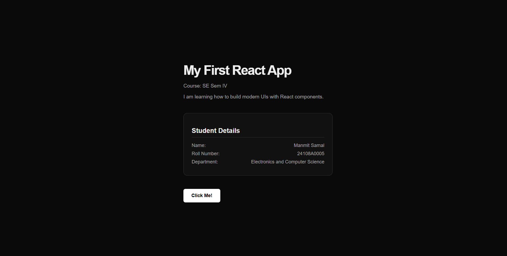
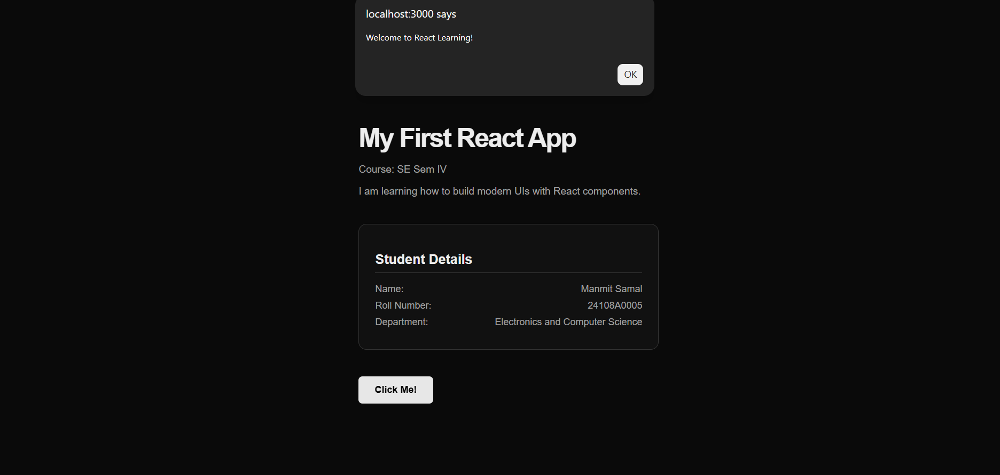
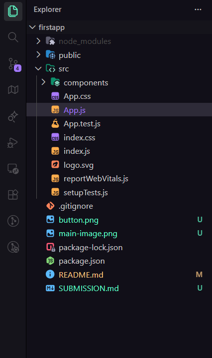

# **LAB - 11**
---
## Student Information

- **Name**: Manmit Samal
- **Roll Number**: 24108A0005
- **Branch**: Electronics and Computer Science
- **Lab 11**: Create Your First React Application
---
## **GitHub Repository**: **https://github.com/not-manmit/web-technology-lab-11.git**
---
## Screenshots

### Screenshot 1: Main Application View

*Description: The main React application displaying course information and student details.*

### Screenshot 3: Interactive Button

*Description: Demonstration of the interactive button functionality.*

### Screenshot 4: Project Structure

*Description: File structure of the React project.*

